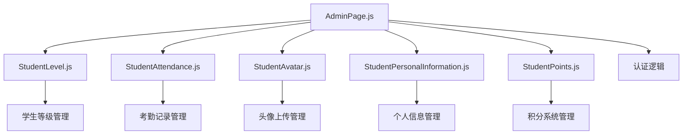
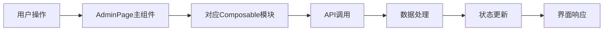

## Product Overview

将AdminPage.js进行模块化重构，按照业务功能拆分为多个独立的composables文件，提升代码的可维护性、复用性和可测试性。

## Core Features

- StudentLevel.js - 学生等级相关功能模块
- StudentAttendance.js - 学生考勤相关功能模块  
- StudentAvatar.js - 学生头像相关功能模块
- StudentPersonalInformation.js - 学生个人信息相关功能模块
- StudentPoints.js - 学生积分相关功能模块
- AdminPage.js - 保留主要管理功能和认证逻辑

## Tech Stack

- 前端框架: Vue 3 + Composition API
- 状态管理: Vue Reactive API (ref, reactive)
- 文件结构: Composables模块化架构
- 代码规范: ESLint + Prettier

## Architecture Design

### System Architecture

采用Composition API模块化架构，将AdminPage按功能拆分为独立的composables：



### Module Division

- **StudentLevel.js**: 等级查询、升级、等级规则管理
- **StudentAttendance.js**: 考勤记录、签到、请假管理
- **StudentAvatar.js**: 头像上传、裁剪、存储管理
- **StudentPersonalInformation.js**: 基本信息CRUD、验证逻辑
- **StudentPoints.js**: 积分计算、兑换、历史记录
- **AdminPage.js**: 路由控制、权限验证、模块协调

### Data Flow



## Implementation Details

### Core Directory Structure

```
front-end/src/
├── composables/
│   ├── admin/
│   │   ├── StudentLevel.js
│   │   ├── StudentAttendance.js
│   │   ├── StudentAvatar.js
│   │   ├── StudentPersonalInformation.js
│   │   └── StudentPoints.js
├── pages/
│   └── AdminPage.js
└── utils/
    └── api.js
```

### Key Code Structures

每个composable模块遵循统一模式：

```javascript
// 模块模板结构
export function useStudentLevel() {
  // 响应式状态
  const levelData = ref([])
  const loading = ref(false)
  
  // 业务方法
  const fetchStudentLevel = async (studentId) => {
    // 业务逻辑
  }
  
  const updateStudentLevel = async (data) => {
    // 业务逻辑
  }
  
  // 返回公共接口
  return {
    levelData,
    loading,
    fetchStudentLevel,
    updateStudentLevel
  }
}
```

### Technical Implementation Plan

1. **模块拆分**: 分析AdminPage.js中的功能代码，按业务逻辑分组
2. **状态管理**: 将大型响应式对象拆分到各模块中
3. **API封装**: 每个模块管理自己的API调用
4. **错误处理**: 统一错误处理机制
5. **类型定义**: 使用TypeScript接口定义数据结构

### Integration Points

- 模块间通过事件总线或provide/inject通信
- 共享状态通过Pinia或全局状态管理
- API请求统一拦截和错误处理
- 权限验证在AdminPage层统一控制

## Design Style

采用Vue 3 Composition API进行组件化重构，使用模块化composables架构。每个功能模块独立封装，通过组合函数方式实现功能复用。UI设计保持现有风格，重点优化代码结构和可维护性。

## Agent Extensions

### SubAgent

- **code-explorer** (from <subagent>)
- Purpose: 分析AdminPage.js文件结构和功能分布，识别需要拆分的代码模块
- Expected outcome: 详细的代码分析报告，包含各功能模块的代码范围和依赖关系